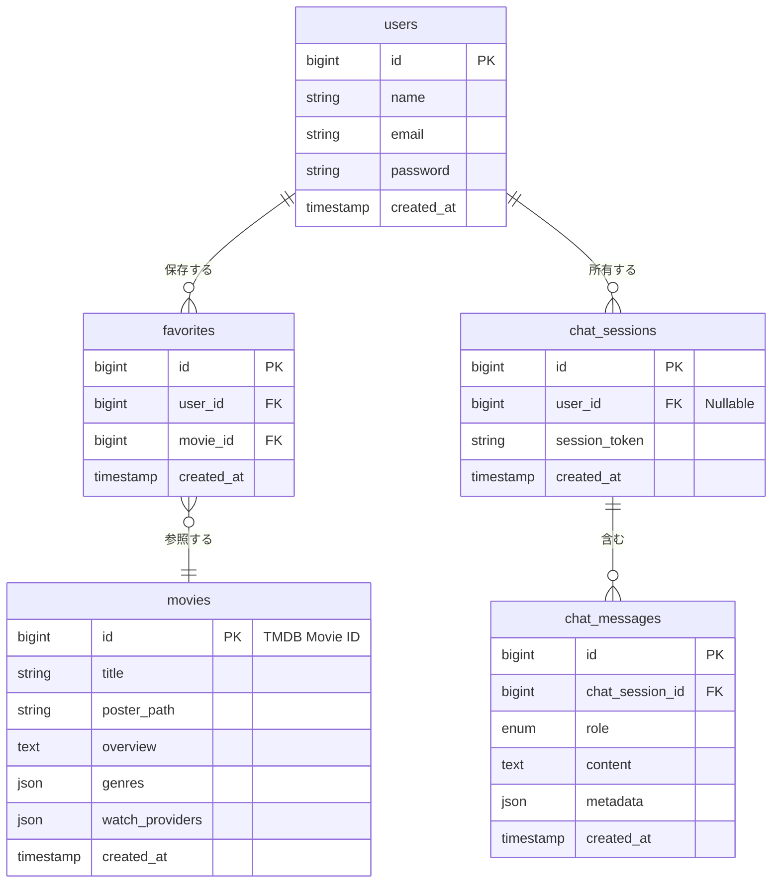
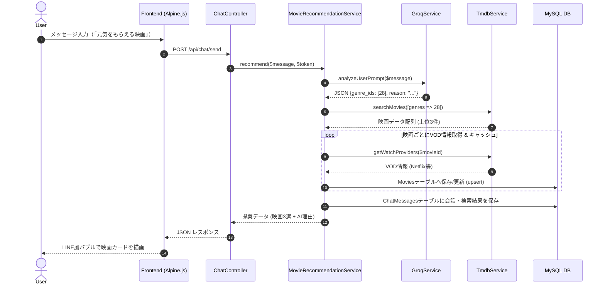

# 【基本設計・詳細設計書】AI感情分析型 映画提案アプリケーション

---

## 1. システムアーキテクチャ設計

### 1.1 アーキテクチャ構成
本システムは Laravel 13 の **Service-Repository パターン（または Action パターン）** を採用し、コントローラーからビジネスロジックおよび外部API（Groq/TMDB）通信を分離する。

```text
[Client (Alpine.js / Blade)]
       │
       ▼ (HTTP Request / JSON)
[ChatController / FavoriteController]
       │
       ▼ (Execute)
[GroqService] ─── (HTTP) ───> [Groq API]
       │
[TmdbService] ─── (HTTP) ───> [TMDB API]
       │
       ▼ (Read / Write)
[MovieRepository / UserRepository]
       │
       ▼ (Query)
[Database (MySQL 8.0)]
```

---

## 2. データベース設計（Migrationレベル）

### 2.1 ER図



### 2.2 マイグレーション仕様

#### ① `users` テーブル
```php
Schema::create('users', function (Blueprint $table) {
    $table->id();
    $table->string('name');
    $table->string('email')->unique();
    $table->timestamp('email_verified_at')->nullable();
    $table->string('password');
    $table->rememberToken();
    $table->timestamps();
});
```

#### ② `movies` テーブル（TMDBキャッシュ）
```php
Schema::create('movies', function (Blueprint $table) {
    $table->unsignedBigInteger('id')->primary(); // TMDB Movie IDをそのまま主キー化
    $table->string('title');
    $table->string('poster_path')->nullable();
    $table->text('overview')->nullable();
    $table->json('genres')->nullable();
    $table->json('watch_providers')->nullable();
    $table->timestamps();
});
```

#### ③ `favorites` テーブル
```php
Schema::create('favorites', function (Blueprint $table) {
    $table->id();
    $table->foreignId('user_id')->constrained()->cascadeOnDelete();
    $table->foreignId('movie_id')->constrained('movies')->cascadeOnDelete();
    $table->timestamps();

    $table->unique(['user_id', 'movie_id']); // 二重保存防止
});
```

#### ④ `chat_sessions` テーブル
```php
Schema::create('chat_sessions', function (Blueprint $table) {
    $table->id();
    $table->foreignId('user_id')->nullable()->constrained()->nullOnDelete();
    $table->string('session_token')->index(); // ゲスト用識別トークン
    $table->timestamps();
});
```

#### ⑤ `chat_messages` テーブル
```php
Schema::create('chat_messages', function (Blueprint $table) {
    $table->id();
    $table->foreignId('chat_session_id')->constrained()->cascadeOnDelete();
    $table->enum('role', ['user', 'assistant']);
    $table->text('content');
    $table->json('metadata')->nullable(); // Groq抽出JSONや提案映画ID一覧
    $table->timestamps();
});
```

---

## 3. ルーティング & APIエンドポイント設計

### 3.1 Web & API Routes (`routes/web.php`)

| メソッド | URI | アクション / コントローラー | 概要 | 認証 |
| :--- | :--- | :--- | :--- | :--- |
| `GET` | `/` | `ChatController@index` | チャット対話画面の表示 | 不要 |
| `POST` | `/api/chat/send` | `ChatController@sendMessage` | メッセージ送信・AI提案処理 | 不要（Session管理） |
| `GET` | `/favorites` | `FavoriteController@index` | お気に入り一覧画面の表示 | 要認証 (`auth`) |
| `POST` | `/api/favorites/toggle` | `FavoriteController@toggle` | お気に入りの追加 / 解除 | 要認証 (`auth`) |

---

## 4. クラス設計（役割定義 & インターフェース）

### 4.1 コントローラー層 (Controllers)
* **`ChatController`**
  * `index()`: チャット画面初期化・セッション保持処理。
  * `sendMessage(SendMessageRequest $request)`: ユーザー入力を受け取り、`MovieRecommendationService` を呼び出してレスポンスを返却。
* **`FavoriteController`**
  * `index()`: お気に入り映画一覧の描画。
  * `toggle(Request $request)`: `movies` テーブルへの追加・非同期お気に入り解除処理。

### 4.2 サービス層 (Services)
* **`MovieRecommendationService`**
  * **役割:** チャット処理のファサード。Groq解析、TMDB検索、ローカルDBキャッシュ処理を統括する。
  * **主要メソッド:** `recommend(string $userMessage, string$sessionToken): array`
* **`GroqService`**
  * **役割:** Groq API通信を担当。ユーザー文章から検索キーワード・ジャンルID・AI推薦理由をJSON構造化抽出。
  * **主要メソッド:** `analyzeUserPrompt(string $prompt): array`
* **`TmdbService`**
  * **役割:** TMDB API通信を担当。映画の検索とVOD配信情報の取得。
  * **主要メソッド:**
    * `searchMovies(array $params): array` (`/discover/movie` 呼び出し)
    * `getWatchProviders(int $tmdbMovieId): array` (`/watch/providers` 呼び出し)

---

## 5. 外部APIモジュール詳細設計（シーケンス・データ構造）


### 5.1 処理シーケンス図（対話・提案フロー）



### 5.2 Groq API 入出力データインターフェース

#### システムプロンプト定義 (`GroqService.php`)
```text
You are an expert movie recommender AI.
Analyze the user's input and extract parameters for TMDB API search.
Respond ONLY with a valid JSON object following this format:

{
  "genre_ids": [28, 35], // Array of TMDB Genre IDs
  "keywords": "action comedy",
  "recommendation_reason": "疲れてるときに何も考えず楽しめるアクションコメディです。"
}
```

---

## 6. フロントエンドコンポーネント設計（LINE風UI）

### 6.1 Alpine.js 状態管理仕様 (`chatApp()`)

```javascript
function chatApp() {
    return {
        messages: [],
        inputMessage: '',
        isLoading: false,

        async sendMessage() {
            if (!this.inputMessage.trim() || this.isLoading) return;
            
            // 1. ユーザー発言を画面に追加
            const userText = this.inputMessage;
            this.messages.push({ role: 'user', content: userText });
            this.inputMessage = '';
            this.isLoading = true;

            // 2. APIリクエスト
            try {
                const response = await axios.post('/api/chat/send', { message: userText });
                // 3. AIレスポンス（映画リスト含む）を表示
                this.messages.push({
                    role: 'assistant',
                    content: response.data.recommendation_reason,
                    movies: response.data.movies // 映画カード3選データ
                });
            } catch (error) {
                console.error(error);
            } finally {
                this.isLoading = false;
            }
        }
    }
}
```