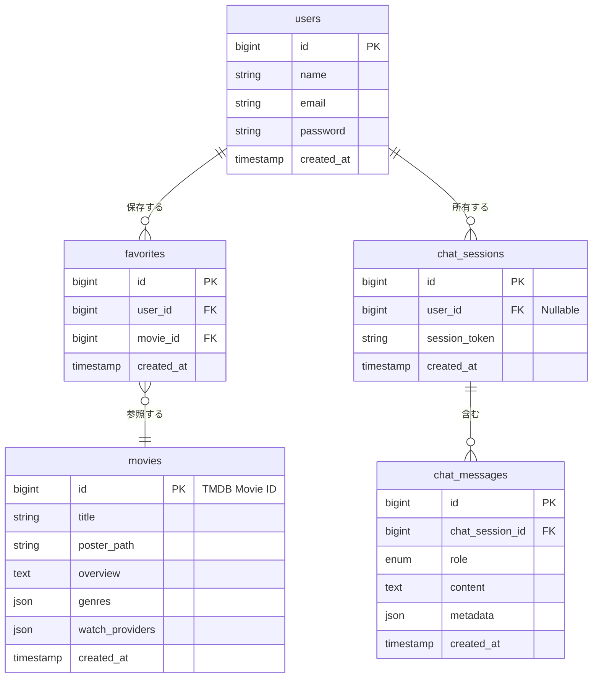

# 【仕様書】AI感情分析型 映画提案アプリケーション

---

## 1. プロジェクト概要 & 要件定義

### 1.1 背景・課題設定
動画配信サービス（VOD）を開いたものの「作品数が多くて選べない」「検索やジャンル絞り込みが面倒」となり、結局何も観ずに時間を消費してしまう「選択のパラドックス」を解決する。

### 1.2 ターゲットユーザー
* **対象:** 仕事終わりに「何か観たいけれど探すのが面倒」だと感じている多忙な社会人
* **ニーズ:** 直感的な言葉（感情・気分・状況）を入力するだけで、今すぐ観たくなる映画を迷わずサクッと決めたい。

### 1.3 解決アプローチ
LINE風のチャットインターフェースを採用。「元気をもらえる映画」「切ない気分」などの曖昧な自然文入力から、Groq（LLM）を用いて検索意図（ジャンル・感情キーワード等）を高速で抽出し、TMDB APIと連携して日本国内で視聴可能なVOD情報付きの映画3選を提案する。

### 1.4 機能要件 (MVP)

| 機能ID | 機能名 | 詳細・仕様 | 技術スタック |
| :--- | :--- | :--- | :--- |
| **F-01** | **チャット対話UI** | LINE風の直感的なインターフェース。非同期通信（Ajax）によりストレスのない対話体験を提供。 | Alpine.js / Tailwind CSS |
| **F-02** | **AI条件解析・抽出** | ユーザーの入力文から、ジャンルID・感情タグ・検索キーワードをJSON形式で抽出し、TMDBクエリに変換。 | Groq API (`llama-3.3-70b-versatile`) |
| **F-03** | **映画提案カード表示** | 条件に合致する映画からおすすめ3選を表示（ポスター、タイトル、あらすじ、AIおすすめ理由）。 | TMDB API / Groq API |
| **F-04** | **VOD配信情報表示** | 日本国内（JP）で視聴可能な配信サービス（Netflix, Amazon Prime, U-NEXT等）のアイコンを表示。 | TMDB Watch Providers API |
| **F-05** | **ユーザー認証** | メールアドレス・パスワードによる新規登録・ログイン・ログアウト機能。 | Laravel Breeze |
| **F-06** | **お気に入り（マイリスト）** | 提案された映画を「あとで観る」としてマイページに保存・削除する機能。 | MySQL (中間テーブル) |

### 1.5 非機能要件
* **応答速度:** チャット送信から映画提案表示まで **5秒以内** を目指す（Groqの超高速推論およびローカルDBキャッシュを活用）。
* **セキュリティ:** Groq API KeyおよびTMDB API Access Tokenは、サーバーサイド（`.env`）でのみ保持・管理し、クライアントへ露呈させない。
* **対応環境:** レスポンシブ対応（スマートフォン表示・モバイルファーストを推奨）。

---

## 2. システムアーキテクチャ設計

### 2.1 全体構成・アーキテクチャパターン
本システムは Laravel 11 の **Service-Repository パターン（または Action パターン）** を採用し、コントローラーからビジネスロジックおよび外部API（Groq/TMDB）通信を分離する。

```text
[Client (Alpine.js / Blade)]
       │
       ▼ (HTTP Request / JSON)
[ChatController / FavoriteController]
       │
       ▼ (Execute)
[GroqService] ─── (HTTP) ───> [Groq API]
       │
[TmdbService] ─── (HTTP) ───> [TMDB API]
       │
       ▼ (Read / Write)
[MovieRepository / UserRepository]
       │
       ▼ (Query)
[Database (MySQL 8.0)]
```

---

## 3. データベース設計（Migrationレベル）

### 3.1 ER図



### 3.2 マイグレーション仕様

#### ① `users` テーブル
```php
Schema::create('users', function (Blueprint $table) {$table->id();
    $table->string('name');$table->string('email')->unique();
    $table->timestamp('email_verified_at')->nullable();$table->string('password');
    $table->rememberToken();$table->timestamps();
});
```

#### ② `movies` テーブル（TMDBキャッシュ）
```php
Schema::create('movies', function (Blueprint $table) {$table->unsignedBigInteger('id')->primary(); // TMDB Movie IDをそのままPK化
    $table->string('title');$table->string('poster_path')->nullable();
    $table->text('overview')->nullable();$table->json('genres')->nullable();
    $table->json('watch_providers')->nullable();$table->timestamps();
});
```

#### ③ `favorites` テーブル
```php
Schema::create('favorites', function (Blueprint $table) {
    $table->id();$table->foreignId('user_id')->constrained()->cascadeOnDelete();
    $table->foreignId('movie_id')->constrained('movies')->cascadeOnDelete();$table->timestamps();

    $table->unique(['user_id', 'movie_id']); // 重複登録防止
});
```

#### ④ `chat_sessions` テーブル
```php
Schema::create('chat_sessions', function (Blueprint $table) {$table->id();
    $table->foreignId('user_id')->nullable()->constrained()->nullOnDelete();$table->string('session_token')->index(); // 未ログイン用トークン
    $table->timestamps();
});
```

#### ⑤ `chat_messages` テーブル
```php
Schema::create('chat_messages', function (Blueprint $table) {$table->id();
    $table->foreignId('chat_session_id')->constrained()->cascadeOnDelete();$table->enum('role', ['user', 'assistant']);
    $table->text('content');$table->json('metadata')->nullable(); // Groq抽出JSONや提案映画ID一覧を保持
    $table->timestamps();
});